<div align="center">

# 🌟 Social App

### A Modern Social Media Platform Built with Next.js

[](https://nextjs.org/)
[](https://react.dev/)
[](https://www.typescriptlang.org/)
[](https://tailwindcss.com/)

[Features](#-features) • [Tech Stack](#-tech-stack) • [Getting Started](#-getting-started) • [Screenshots](#-screenshots)

</div>

---

## 📖 Overview

Social App is a feature-rich social media platform that enables users to share posts, interact with content, follow other users, and build their social network. Built with modern web technologies and best practices, it delivers a seamless and responsive user experience.

## ✨ Features

### 🔐 Authentication & Authorization

- **User Registration & Login** - Secure authentication system
- **Protected Routes** - Middleware-based route protection
- **Session Management** - Persistent user sessions

### 👤 User Profile

- **Profile Management** - Edit profile information and avatar
- **Profile Viewing** - View own and other users' profiles
- **User Statistics** - Posts, followers, and following counts
- **Follow/Unfollow** - Social connection management

### 📝 Posts & Content

- **Create Posts** - Share images with captions
- **Feed Timeline** - Infinite scroll feed with latest posts
- **Like Posts** - React to content with likes
- **Save Posts** - Bookmark favorite posts
- **Optimistic UI Updates** - Instant feedback on user actions

### 💬 Comments, Like, & Interactions

- **Comment System** - Engage in discussions on posts
- **Real-time Updates** - Live comment count updates
- **Nested Comments** - Reply to comments (if implemented)
- **Like System** – Appreciate posts with a single tap and see total likes in real time

### 🔍 Search & Discovery

- **User Search** - Find users by name or username
- **Infinite Scroll** - Seamless content loading
- **Search Suggestions** - Real-time search results
- **Search Users** - Real-time search your friends

### 🎨 UI/UX Features

- **Responsive Design** - Mobile-first approach
- **Optimistic Updates** - Instant UI feedback
- **Loading States** - Skeleton loaders and spinners
- **Form Validation** - React Hook Form with Zod validation
- **Toast Notifications** - User feedback system
- **Modal Dialogs** - Elegant popups and confirmations

## 🛠 Tech Stack

### Frontend Framework

<div align="left">

| Technology                                                                                               | Description                    | Version |
| -------------------------------------------------------------------------------------------------------- | ------------------------------ | ------- |
|           | React framework with SSR & SSG | 16.0.7  |
|                 | UI library                     | 19.2.0  |
|  | Type-safe JavaScript           | 5.0     |

</div>

### Styling & UI

<div align="left">

| Technology                                                                                                    | Description                    | Version  |
| ------------------------------------------------------------------------------------------------------------- | ------------------------------ | -------- |
|  | Utility-first CSS framework    | 4.0.0    |
|             | Unstyled accessible components | Latest   |
|                   | Beautiful icon library         | 0.555.0  |
|                   | Animation library              | 12.23.25 |

</div>

### State Management & Data Fetching

<div align="left">

| Technology                                                                                                  | Description             | Version |
| ----------------------------------------------------------------------------------------------------------- | ----------------------- | ------- |
|    | State management        | 2.11.0  |
|  | Server state management | 5.90.11 |
|                    | HTTP client             | 1.13.2  |

</div>

### Form Handling & Validation

<div align="left">

| Technology                                                                                                            | Description       | Version |
| --------------------------------------------------------------------------------------------------------------------- | ----------------- | ------- |
|  | Form management   | 7.67.0  |
|                                    | Schema validation | 4.1.13  |

</div>

### Additional Libraries

- **class-variance-authority** - Component variants
- **clsx & tailwind-merge** - Conditional classes
- **dayjs** - Date manipulation
- **sonner** - Toast notifications
- **next-themes** - Theme management
- **react-intersection-observer** - Infinite scroll

## 🚀 Getting Started

### Prerequisites

- Node.js 18+ installed
- npm, yarn, or pnpm package manager
- Backend API running (configure in `.env.local`)

### Installation

1. **Clone the repository**

   ```bash
   git clone https://github.com/hanssav/wph-social-app
   cd wph-social-app
   ```

2. **Install dependencies**

   ```bash
   npm install
   # or
   yarn install
   # or
   pnpm install
   ```

3. **Set up environment variables**

   Create a `.env.local` file in the root directory:

   ```env
   NEXT_PUBLIC_API_URL=https://social-media-be-400174736012.asia-southeast2.run.app/api
   ```

4. **Run the development server**

   ```bash
   npm run dev
   # or
   yarn dev
   # or
   pnpm dev
   ```

5. **Open your browser**

   Navigate to [http://localhost:3000](http://localhost:3000)

### Build for Production

```bash
npm run build
npm start
```

## 📸 Screenshots

### Authentication

<div align="center">
  
  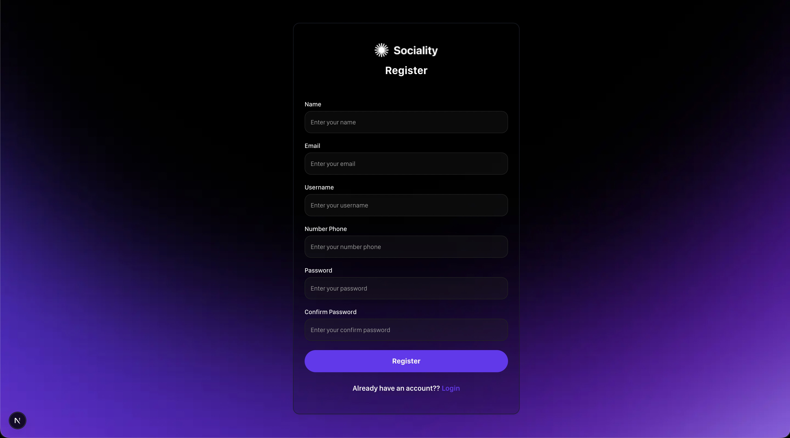
</div>

### Feed & Posts

<div align="center">
  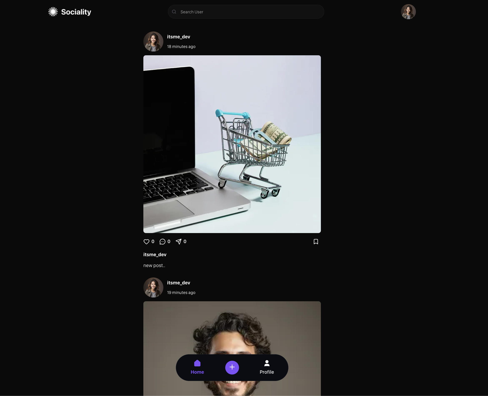
  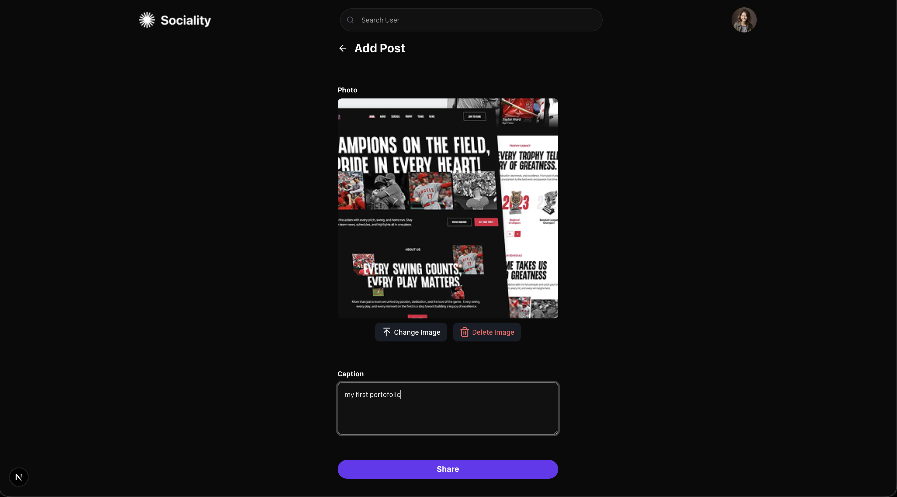
</div>

### Profile & Interactions

<div align="center">
  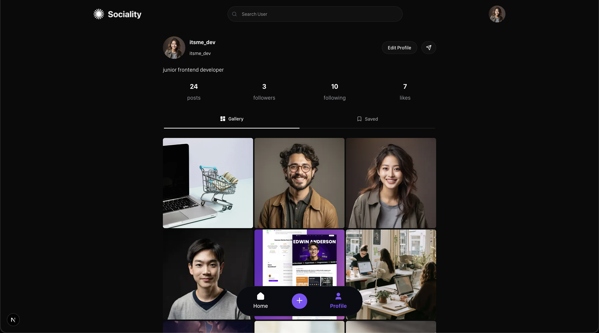
  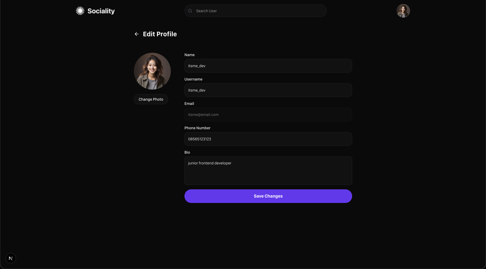
</div>

### Features Showcase

<div align="center">
  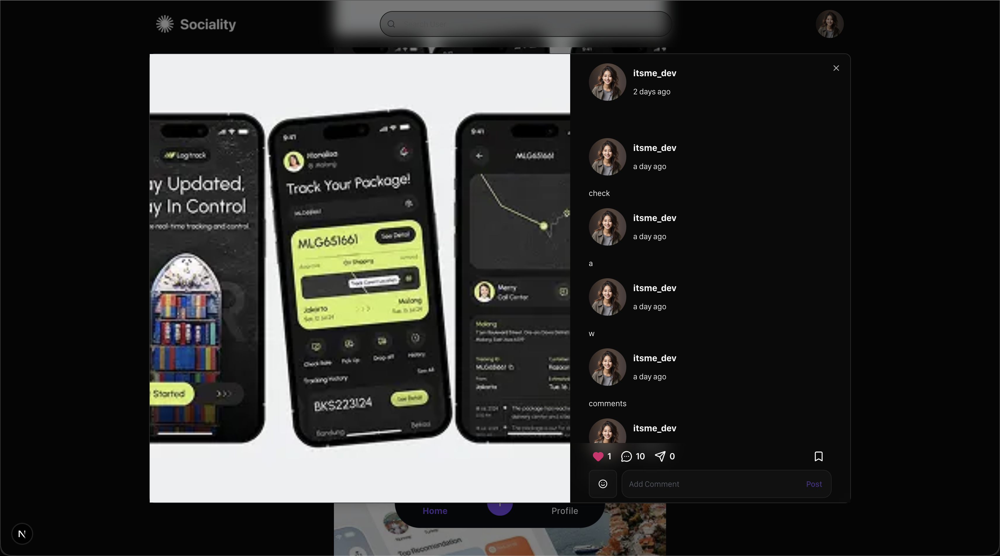
  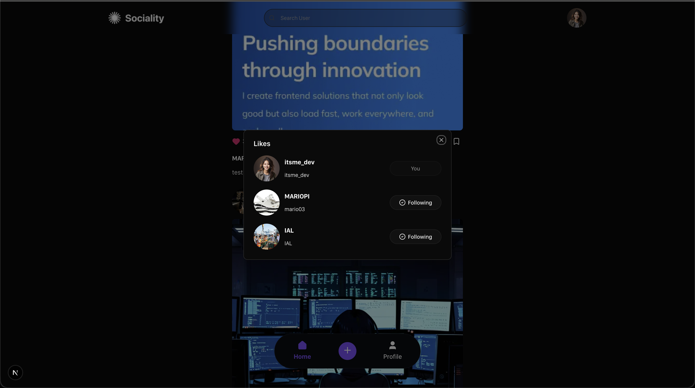
</div>

<div align="center">
  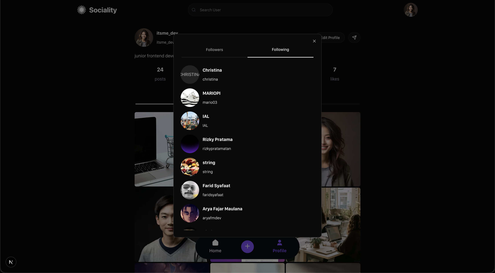
  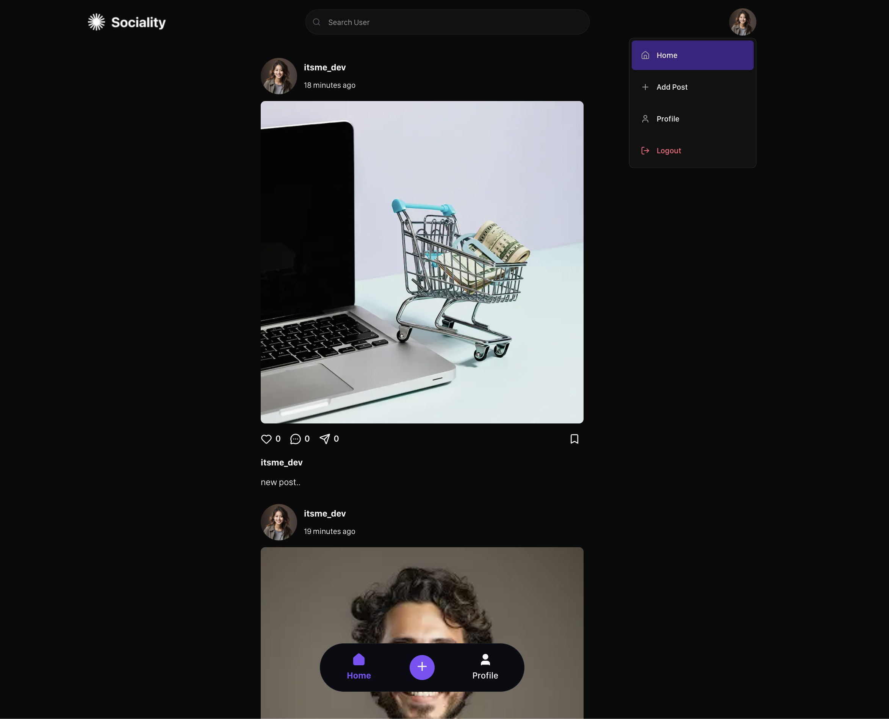
</div>

### Form Validation

<div align="center">
  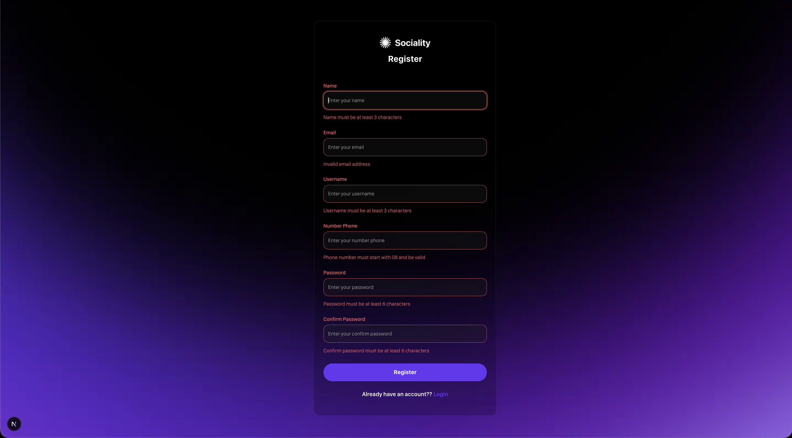
</div>

### Other users

<div align="center">
  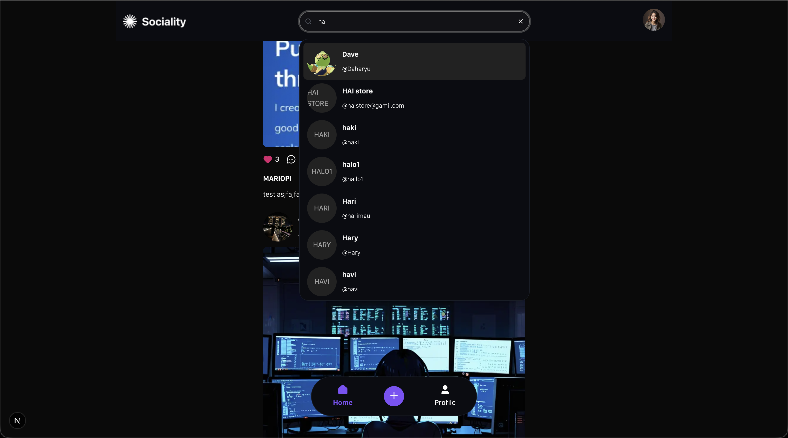
  
  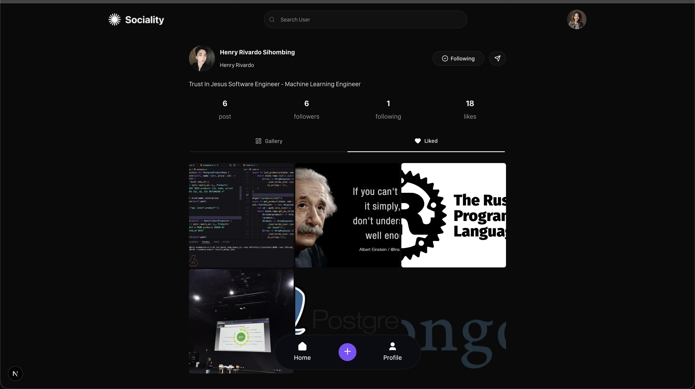
  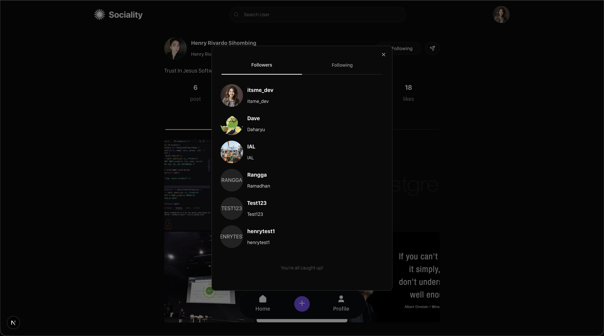
</div>

### Optimistic UI Updates Example

<div align="center">
  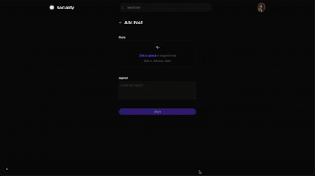
  <p><em>Real-time UI updates with optimistic rendering for instant user feedback</em></p>
</div>

## 🏗 Project Structure

```
wph-social-app/
├── src/
│   ├── app/                    # Next.js app directory
│   │   ├── (auth)/            # Authentication routes
│   │   ├── (user)/            # Protected user routes
│   │   └── layout.tsx         # Root layout
│   ├── components/            # React components
│   │   ├── container/         # Container components
│   │   ├── pages/             # Page-specific components
│   │   └── ui/                # Reusable UI components
│   ├── hooks/                 # Custom React hooks
│   ├── lib/                   # Utility libraries
│   ├── schema/                # Zod validation schemas
│   ├── services/              # API services
│   ├── store/                 # Redux store
│   └── constants/             # App constants
├── public/                    # Static assets
└── docs/                      # Documentation
```

## 🎯 Key Features Implementation

### Optimistic UI Updates

The app implements optimistic updates for better UX:

- Instant like/unlike feedback
- Immediate comment posting
- Real-time follow/unfollow
- Seamless post deletion

### Infinite Scroll

Efficient data loading with:

- React Intersection Observer
- TanStack Query pagination
- Smooth scrolling experience
- Loading states

### Form Validation

Robust form handling with:

- React Hook Form for performance
- Zod schema validation
- Real-time error feedback
- Type-safe forms

## 🤝 Contributing

Contributions are welcome! Please feel free to submit a Pull Request.

## 📝 License

This project is licensed under the MIT License.

## 👨‍💻 Author

**Handi Irawan**

---

<div align="center">
  <p>Built with ❤️ using Next.js and React</p>
  <p>⭐ Star this repo if you find it helpful!</p>
</div>
